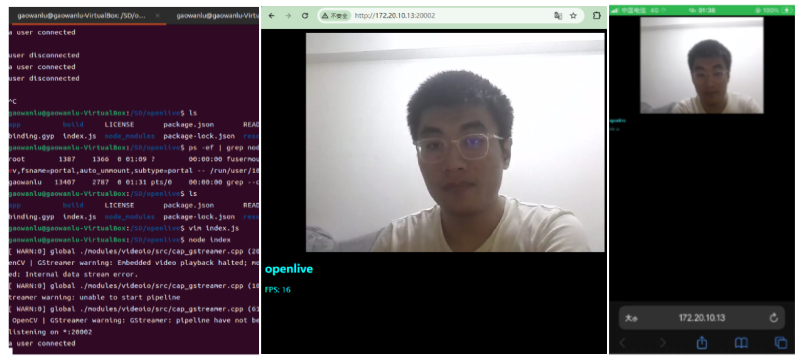

# OpenLive

The OpenCV camera video stream used is pushed to the browser solution based on Base64 encoding in H264 format and transmitted using websocket. Use POSIX multithreading and C/C++plugins with Node API.

Can be used on Linux development boards such as Raspberry Pi and Linux system personal computers

## Scheme

Player : <https://github.com/mbebenita/Broadway>

```txt

/**************************************************************************/
*     C++ module             <---->  Node SocketIO <---->  Browser(Player) *
* capture thread         <----------                       /|\              *
*    Take Frame(Loop)      start()                          |               *
*   |                                                       |               *
*   | Image(get_mat())                                      |               *
*   |                                                       |               *
*  \|/                                                      |               *
* encode_thread(Loop)                                       |               *
*   |-Convert to YUV color                      (H264Stream)|               *
*   | space                                                 |               *
*   |                                                       |               *
*   |-H264 encoder encodi-                                  |               *
*   | ng                                                    |               *
*   |                                                       |               *
*   |-Add H264 stream                                       |               *
*   | data to buffer                                        |               *
*   | queue                                                 |               *
*      |                              (Loop)                |               *
*      |------------------------->   io.emit()  ------------|               *
*       getFrame getMat  callback()                                         *
*                                                                           *
/**************************************************************************/
```

## Environmental Preparation

* [Libx264](https://www.videolan.org/developers/x264.html)
* [OpenCV](https://github.com/opencv/opencv)

```shell
sudo apt install libx264-dev
sudo npm install -g node-gyp
sudo apt install libopencv-dev pkg-config
npm install
```

## Nodejs API

* `import openlive`

```js
const openlive = require('./build/Release/openlive');
```

* `setConf`

configuration parameter

```js
openlive.setConf({
    "path": "0",
    "encodeBufferLen": 5,
    "captureBufferLen": 5
});
```

path(string): The default is "0", opencv opens the camera's parameters, camera device number,/dev/video0. Simultaneously supports HTTP streaming, such as using MJPEG Streamer to push streams, which can be filled in ` http://ip:port `.  
encodeBufferLen(number): Default value is 5 , encoder frame buffer size.
captureBufferLen(number): The default value is 5, and the camera takes the image frame buffer size.  

* `getMat`

Retrieve the encoded H264 bare stream frame data from the encoder, and the returned data is encoded in Base64 format. It needs to be called after the start method is called before it can be called.

```js
openlive.getMat((res) => {

});
```

* `start`

Please call after calling the setConf method. The return value is a Boolean value. The range of openlive startup success is true, otherwise it returns false. After starting, the getMat method can be used.

```js
openlive.start()
```

## How to run it

```shell
node-gyp configure
npm run build
node index
```



## Examples

* [index.js](./index.js) default function .
* [local_svr.js](./local_svr.js) default function, to push stream for proxy_svr.js .
* [proxy_svr.js](./proxy_svr.js) recv stream from local_svr, broadcast chat message to client .

## Local_svr and proxy_svr

Your camera device doesn’t have a public IP, so it can’t be accessed from outside your local network (for example, if the camera is in Beijing, China, and you’re trying to view it from your phone’s browser in Washington, D.C.).

To fix this, you can set up the proxy_svr service on a cloud server to relay your video feed, making it available as a cloud-based service.

```bash
node local_svr.js(20003)  --auth(proxy message)
                            |-->  node proxy_svr.js(20004)  --chat message--> client1
                                                                          --> client2
                                                                          --> client3
                                                                          --> ...
```
